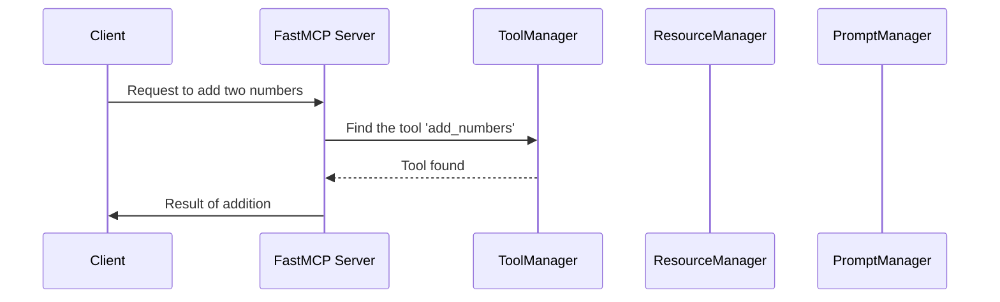

# Chapter 1: FastMCP Server

Welcome to your journey with `fastmcp`! In this first chapter, we dive into the exciting world of the FastMCP Server. Think of the FastMCP Server as the core command center in a network of operations—a powerful hub that orchestrates various tools, resources, and prompts.

## Motivation

Imagine you're running a business that requires organizing various services—handling customer queries, processing data, and managing workflows. You need a system that can centralize these operations, making your tasks more efficient. FastMCP Server is designed for just that! It acts as your multi-functional terminal, enabling seamless communication between different components of your system.

### Key Concepts

1. **Central Hub**: FastMCP Server is at the core of your operations, much like the main terminal at a bustling train station, managing the flow of information and tasks.
   
2. **Modular Design**: It's flexible, allowing you to integrate other FastMCP Servers to expand its capabilities, just like adding more train lines to serve new areas.

3. **Efficient Management**: FastMCP Server helps you efficiently manage various functionalities—be it tools for data processing or prompts for handling queries, akin to having a station control room overlooking operations.

## How to Use FastMCP Server

Let's start with a simple example. Suppose you want to set up a server to handle tools for data processing. Below are the steps to get you started!

### Example Code Setup

```python
from fastmcp.server import FastMCP

# Initialize the FastMCP Server
server = FastMCP(name="MyServer")

# Define a simple tool
@server.tool(name="add_numbers")
def add(x: int, y: int) -> int:
    return x + y

# Run the server
server.run()
```

**Explanation**:
- We first import `FastMCP` and create a new server instance, naming it "MyServer".
- Next, we define a tool named "add_numbers" that adds two numbers and registers it with our server.
- Finally, we run the server, ready to handle your data processing needs.

### Internal Workings

To truly grasp what happens beneath the hood when you use a FastMCP Server, consider this sequence diagram:



This diagram illustrates a simple interaction where the client asks the server to execute the `add_numbers` tool. The server, through its managers, locates the tool, executes it, and returns the result to the client.

### Diving Deeper in Code

The following code resides in the `server.py` file, highlighting a core aspect of managing tools using the `ToolManager`.

```python
class FastMCP:
    def __init__(self, **settings: Any):
        self._tool_manager = ToolManager(
            duplicate_behavior=settings.get('on_duplicate_tools', 'warn')
        )
        # More initializations...

    async def get_tools(self) -> dict[str, Tool]:
        tools = self._tool_manager.get_tools()
        # Additional logic...

    def add_tool(self, fn: Callable, **kwargs) -> None:
        self._tool_manager.add_tool_from_fn(fn, **kwargs)
        # Additional logic...
```

**Explanation**:
- We initialize the `ToolManager` to help register and manage tools.
- `get_tools` fetches all available tools.
- `add_tool` registers a new tool function with the server, handled internally by the `ToolManager`.

## Conclusion

In this chapter, we've introduced the FastMCP Server—a central hub for managing your various operations efficiently. You now understand how to set up a server, register tools, and execute them with ease. From here, we transition to the next crucial component, the [Client](02_client_.md), which connects and communicates with our server.

Stay tuned as we continue exploring `fastmcp` and its capabilities in the coming chapters, making your management tasks less daunting and more streamlined!

---

Generated by [AI Codebase Knowledge Builder](https://github.com/The-Pocket/Tutorial-Codebase-Knowledge)