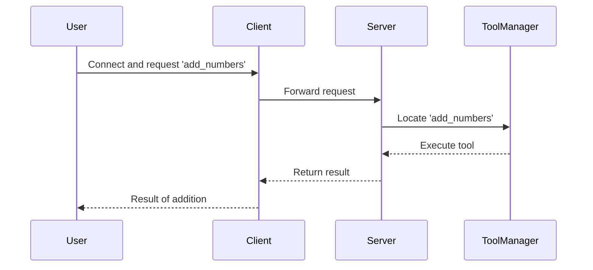

# Chapter 2: Client

In the previous chapter, we explored the [FastMCP Server](01_fastmcp_server_.md), which acts as the central hub in the FastMCP ecosystem. Today, we turn our focus to the `Client`, a crucial part of the conversation between a user's commands and the server’s capabilities.

## Motivation

Imagine you're watching TV and using a remote control to change channels and adjust volume—the remote serves as a bridge between you and the TV's functionality. Similarly, the Client in FastMCP functions as this bridge, connecting and interacting with the FastMCP Server. 

### Central Use Case

Consider this situation: you've set up a FastMCP Server to perform data processing tasks. Now, you need a way to send tasks to the server and get responses back, like requesting a specific calculation and receiving the results. The Client allows you to make these requests conveniently. 

## Key Concepts

### 1. Connection and Communication

The Client is responsible for establishing a connection with the FastMCP Server. It sends requests to the server and relays responses back to you. Think of it like picking up the phone—dialing into the server and having a conversation.

### 2. Remote Control

Just as changing channels on your TV involves pushing buttons on a remote, using the Client involves sending specific requests. This could be to run a tool or access a resource on the server. 

## How to Use the Client

Let's look at a simple example: you're connecting a Client to our FastMCP Server to call a tool named "add_numbers". 

### Example Code Setup

```python
from fastmcp.client.client import Client

# Create a client with a transport option (e.g., server address)
client = Client(transport="http://localhost:8080")

# Connect to the server
async def main():
    async with client:  # Manages the connection
        result = await client.call_tool("add_numbers", {"x": 1, "y": 2})
        print("Result:", result)

```

**Explanation**:
- We initialize a `Client` with a transport, indicating where to find the server.
- Using an asynchronous context manager (`async with`), the Client connects to the server.
- We call the `add_numbers` tool on the server, sending two numbers, `1` and `2`, and print the result.

### Expected Output

The code above should print:
```
Result: 3
```

### Internal Workings

To understand how the Client operates under the hood, let's walk through a simplified sequence of events. Picture an interaction where the Client calls a tool on the server:



This diagram illustrates the Client relaying a tool request to the server, which processes it and returns the result.

## Diving Deeper in Code

Here's a simplified peek into the Client's internal workings from the `client.py` file:

```python
class Client:
    def __init__(self, transport):
        self.transport = infer_transport(transport)
        self._session = None

    async def __aenter__(self):
        # Initiate a connection using the transport
        self._session = self.transport.connect_session()
        return self

    async def __aexit__(self, exc_type, exc_val, exc_tb):
        # Clean up the connection
        self._session.close()

    async def call_tool(self, name, arguments):
        # Send a tool request via the current session
        return await self._session.call_tool(name, arguments)
```

**Explanation**:
- The `Client` initializes with a transport, deciding how to connect to the server.
- The async context manager methods `__aenter__` and `__aexit__` manage opening and closing the connection.
- The `call_tool` method is used to send requests to the server to perform specific tasks.

## Conclusion

You've now learned how the Client in FastMCP acts as a mediator between your requests and the server's capabilities. It allows you to harness the server's power remotely and efficiently handle operations. As you become more familiar with these components, the next step is exploring [OpenAPI Integration](03_openapi_integration_.md), which enhances interaction capabilities within FastMCP.

This chapter has equipped you with the basics of using the Client in FastMCP to interact with the server. Keep following this tutorial series as we delve deeper into integrating industry-standard APIs!

---

Generated by [AI Codebase Knowledge Builder](https://github.com/The-Pocket/Tutorial-Codebase-Knowledge)