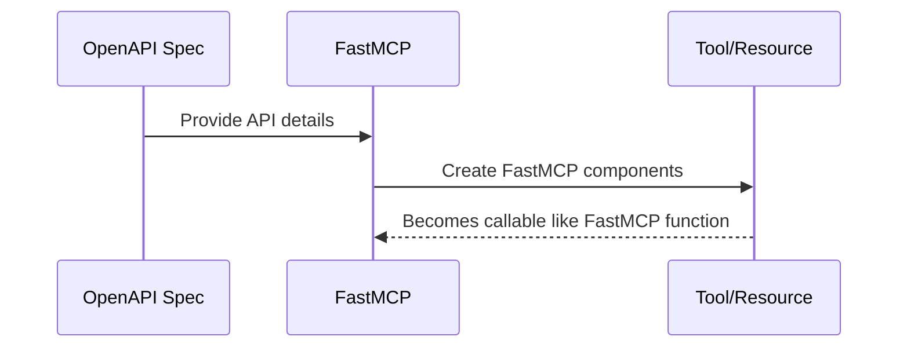

# Chapter 3: OpenAPI Integration

In the previous chapter, we explored the role of the [Client](02_client_.md) within the FastMCP ecosystem to connect and communicate with the FastMCP Server. Now, let's turn our attention to OpenAPI Integration, a powerful feature that allows FastMCP to seamlessly interact with existing APIs.

## Motivation

Imagine you've just opened a restaurant, and you want to offer your customers the ability to view menus, place orders online, and get real-time updates on their order status. These functionalities can be achieved using APIs. However, integrating multiple APIs into your FastMCP setup might feel daunting. This is where OpenAPI Integration comes in handy—it acts as an adapter that simplifies the process of connecting and working with these APIs.

### Central Use Case

Suppose you want to build a feature in FastMCP that checks the weather using a public weather API. The FastMCP OpenAPI Integration allows you to define this API interaction within your system using OpenAPI specifications, creating components that make API calls as easy as native functions.

## Key Concepts

### 1. OpenAPI Specifications

**OpenAPI Specification** is a standard way to define and describe APIs. It provides a detailed format of how your API endpoints look, what parameters they accept, and what responses they generate.

### 2. FastMCP Components

Through OpenAPI Integration, FastMCP can transform these API definitions into FastMCP components like Tools, Resources, or Resource Templates. It essentially translates API capabilities into FastMCP's operational language.

### 3. Interaction

Once the API is integrated, FastMCP can leverage its functionalities, allowing you to interact with it as if it's a part of your system. This means performing actions like checking the weather API becomes a straightforward function call in FastMCP.

## How to Use OpenAPI Integration

To integrate an OpenAPI specification, you can set up a FastMCP server dedicated to handling these interactions. Here's a simplified example:

```python
from fastmcp.server.openapi import FastMCPOpenAPI
import httpx

# Load or define your OpenAPI specification
openapi_spec = {...}  # Replace with your actual OpenAPI spec

# Create a FastMCP server to interact with the OpenAPI
server = FastMCPOpenAPI(
    client=httpx.AsyncClient(),
    openapi_spec=openapi_spec,
    name="Weather API Server"
)
```

**Explanation**:
- We initialize the FastMCPOpenAPI with an `httpx.AsyncClient` and your OpenAPI specifications.
- This server will now manage the integration with the specified API, facilitating smooth communication.

### Expected Use

With the server set up, you can now use it like any other FastMCP Server to define and execute API-based operations, leveraging the API's capabilities as FastMCP Tools or Resources.

## Internal Workings

Let's take a peak at how OpenAPI Integration translates an OpenAPI specification to FastMCP components:



Here's a very high-level view:
- The OpenAPI Spec provides details of the API.
- The FastMCP server translates these details into components (Tools/Resources).
- These components are now ready to be used within FastMCP just like built-in functions.

### Diving Deeper in Code

This transformation takes place in files such as `openapi.py`, which handles reading the OpenAPI specification and dynamically creating components.

```python
class FastMCPOpenAPI(FastMCP):
    ...
    def __init__(self, openapi_spec, client, name=None, route_maps=None, **settings):
        ...
        http_routes = openapi.parse_openapi_to_http_routes(openapi_spec)
        ...
        
    def _create_openapi_tool(self, route, operation_id):
        ...
        tool = OpenAPITool(
            ...
        )
        ...
```

**Explanation**:
- `FastMCPOpenAPI` initializes by parsing the specification.
- It creates components using methods like `_create_openapi_tool`, transforming API endpoints into manageable Tools.

## Conclusion

In this chapter, we've learned how OpenAPI Integration in FastMCP acts as a bridge between APIs and the FastMCP ecosystem. You've discovered how to set up and leverage this integration to incorporate external functionalities seamlessly. In the next chapter, we'll explore the [Proxy](04_proxy_.md) component, which supports efficient API request handling.

---

Generated by [AI Codebase Knowledge Builder](https://github.com/The-Pocket/Tutorial-Codebase-Knowledge)