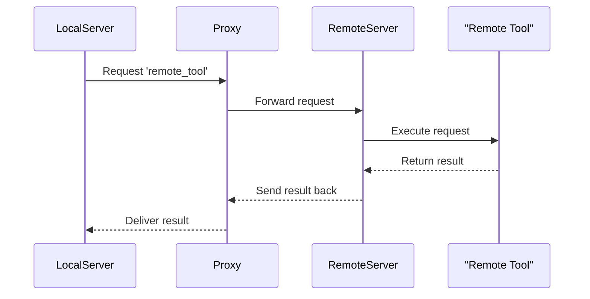

# Chapter 4: Proxy

Welcome back! In the last chapter, we explored [OpenAPI Integration](03_openapi_integration_.md) and how it helps FastMCP interact with external APIs. Now, we pivot to a new concept: the Proxy. This chapter will unpack how Proxies work within FastMCP, functioning as a bridge that connects local and remote servers seamlessly.

## Motivation

Imagine you have an orchestra, and you need someone to coordinate between musicians across different places, ensuring everyone plays harmoniously together. Similarly, a Proxy in FastMCP acts as this coordinator, connecting your local server to remote or external servers. This allows you to use resources from different locations as if they were right at your fingertips.

### Central Use Case

Let’s take a simple example. You have a local FastMCP server managing some tools and resources, but there's a powerful tool located on a remote FastMCP server. You want to use this remote tool without transferring it to your local machine. A Proxy allows you to access and use it directly from the remote location.

## Key Concepts

### 1. Middleman Functionality

A Proxy acts like a middleman by relaying requests and responses between your local server and external servers. This means you can ask for a tool to be run on a remote server and get the result back, all as if it were happening locally.

### 2. Seamless Access

Proxies help maintain a smooth workflow by providing seamless access to remote functionalities. It's like having a universal remote that can control devices in different rooms effortlessly.

### 3. Distributed Resources

By using a Proxy, your server can leverage distributed resources, enhancing capabilities without the need to duplicate resources across multiple servers.

## How to Use a Proxy

Here's a basic setup showing how to set up a Proxy to connect to a remote FastMCP server and use its tools:

```python
from fastmcp.server.proxy import FastMCPProxy
from fastmcp.client.client import Client

# Create a Client to connect to the remote server
remote_client = Client(transport="http://remote-server-address")

# Initialize FastMCPProxy with the remote client
proxy_server = FastMCPProxy(client=remote_client)

async def main():
    # Use the proxy to access a tool from the remote server
    async with proxy_server.client as client:
        result = await client.call_tool("remote_tool", {"param": "value"})
        print("Result from remote tool:", result)
```

**Explanation**:
- We initialize a `Client` pointing to the remote server's address.
- We then create a `FastMCPProxy` using this client, equipping our local setup to connect with the remote server.
- The `call_tool` method on the client is used to execute a remote tool seamlessly.

### Expected Output

When you run the above code, you will see:
```
Result from remote tool: <result_data>
```
This confirms that the remote tool was successfully accessed and used.

## Internal Workings

Let's explore what happens under the hood when you use a Proxy to communicate with a remote server.



This diagram shows how a Proxy handles requests, comfortably interacting across servers to fetch results.

### Diving Deeper in Code

Within the `proxy.py` file, the Proxy's magic is made possible by several classes such as `ProxyTool`, `ProxyResource`, and `FastMCPProxy`.

```python
class ProxyTool(Tool):
    def __init__(self, client, **kwargs):
        super().__init__(**kwargs)
        self._client = client

    async def run(self, arguments, context=None):
        async with self._client:
            result = await self._client.call_tool(self.name, arguments, _return_raw_result=True)
        if result.isError:
            raise Exception("Error in executing tool remotely")
        return result.content
```

**Explanation**:
- `ProxyTool` uses a client to forward a tool execution request to the remote server.
- The method `run` checks for errors and returns the results back to the local server.

## Conclusion

Throughout this chapter, we've explored how Proxies in FastMCP act as powerful intermediaries, seamlessly connecting local operations with remote resources. This enables efficient and flexible use of distributed tools and resources. Next, we'll dive into another exciting component - the [Tool](05_tool_.md), which helps you perform specific tasks. Stay tuned as we continue our journey with FastMCP!

---

Generated by [AI Codebase Knowledge Builder](https://github.com/The-Pocket/Tutorial-Codebase-Knowledge)