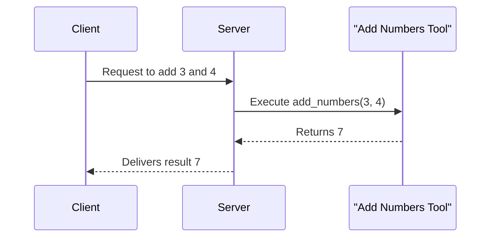

# Chapter 5: Tool

Welcome to Chapter 5! In the previous chapter, we demystified the concept of a [Proxy](04_proxy_.md) and how it acts as a bridge to connect different servers. Now, we're diving into the world of Tools in FastMCP, which are essentially the nuts and bolts of getting tasks done.

## Motivation

Imagine you have a toolbox at home. Each tool inside—like a hammer, screwdriver, or wrench—has a specific purpose. In FastMCP, a "Tool" is like one of those handy instruments, designed to perform a specific function. Whether you need to add numbers, echo some text, or fetch data from an API, Tools in FastMCP are up to the task.

### Central Use Case

Consider this scenario: You're building a simple calculator service using FastMCP. You want it to add two numbers when requested. This is where FastMCP's Tools come in—they allow you to define precise operations, like an addition function, making them ready to execute whenever needed.

## Key Concepts

### 1. Callable Function

A Tool is essentially a callable function, passing parameters and getting results back. Think of it as giving instructions to your microwave: "heat this for 2 minutes," and it starts the task.

### 2. Synchronous and Asynchronous Execution

Tools can work in two different modes: synchronously (one task after another) or asynchronously (multiple tasks happening at once). This flexibility is like either walking one step at a time or juggling, doing multiple things simultaneously.

### 3. Abstraction of Complexity

Tools are designed to hide the complex details, allowing you to focus on what you want to achieve, not how it's done. It's like using a TV remote without knowing how the signal reaches the television.

## How to Use a Tool

Let's walk through setting up a Tool to add numbers, piece by piece:

1. **Define the Tool Function**: Create a simple function to add numbers.

   ```python
   def add_numbers(x: int, y: int) -> int:
       return x + y
   ```

   **Explanation**: This function takes two integers, `x` and `y`, and returns their sum.

2. **Register the Tool with FastMCP Server**:

   ```python
   from fastmcp.server import FastMCP

   server = FastMCP(name="Calculator")

   @server.tool(name="add_numbers")
   def add(x: int, y: int) -> int:
       return x + y

   server.run()
   ```

   **Explanation**: 
   - We create a FastMCP server called "Calculator".
   - We register the `add_numbers` function as a Tool with the server. 
   - Finally, we run the server so it’s ready to perform operations like adding numbers.

### Expected Output

When you send a request to add two numbers using this setup, the server will return the sum. For example:
```
Request: add_numbers(3, 4)
Response: 7
```

## Internal Workings

Let's peek behind the curtains and see how FastMCP manages Tools internally.

### Tool Execution Sequence

Visualize the process of executing a Tool with this simple sequence diagram:



### Code Implementation Insight

The handling of Tools involves several layers in FastMCP's code. Here’s a simplified slice of how it’s done:

- **Tool Registration**: When you define a Tool, it gets internally registered for the server to recognize.

  ```python
  class Tool(BaseModel):
      fn: Callable[..., Any]  # Function to be executed
      name: str  # Name of the tool

      async def run(self, arguments: dict[str, Any]):
          return await self.fn(**arguments)
  ```

  **Explanation**:
  - Each Tool stores a function (`fn`) and a name.
  - The `run` method executes the function using the provided arguments.

- **Tool Manager**: FastMCP uses a ToolManager to handle registering and calling Tools.

  ```python
  class ToolManager:
      def add_tool(self, fn: Callable, name: str):
          self.tools[name] = Tool(fn, name=name)

      async def call_tool(self, name: str, arguments: dict):
          tool = self.tools[name]
          return await tool.run(arguments)
  ```

  **Explanation**:
  - Tools are stored in a dictionary, allowing easy retrieval by name.
  - `call_tool` fetches the right tool and executes it with given arguments.

## Conclusion

This chapter guided you through understanding and using Tools in FastMCP—versatile functions ready to execute specific tasks with simplicity and power. You've learned how to create, register, and call these operations, making them invaluable to your FastMCP projects. Next, we'll explore the concept of a [Prompt](06_prompt.md), diving into ways to manage dynamic interactions. Stay tuned for more insights and capabilities in the FastMCP journey!

---

Generated by [AI Codebase Knowledge Builder](https://github.com/The-Pocket/Tutorial-Codebase-Knowledge)