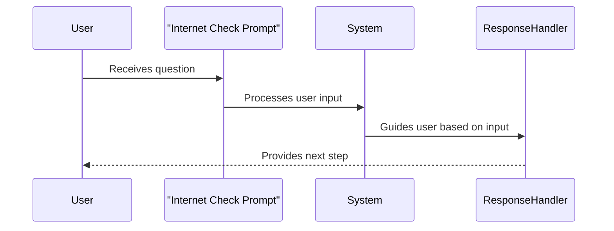

# Chapter 6: Prompt

Welcome back! In the previous chapter, we explored the concept of a [Tool](05_tool_.md) in FastMCP, which helps you perform specific tasks. Now, we embark on an exciting journey to understand "Prompts" in FastMCP—a key component that acts as dynamic conversational starters to drive interactions.

## Motivation

Imagine you are setting up an interactive customer support system. You want it to not just answer questions, but to initiate dialogues with the users, guiding them towards solutions. This is where Prompts come into play. They serve as predefined message templates that can adapt based on user inputs, making interactions smoother and more efficient.

### Central Use Case

Consider this scenario: You have a system that helps users troubleshoot internet connectivity issues. You can create a Prompt as the initial query: "Are you experiencing any network issues?". Based on the user's response, the system can guide the user through possible solutions.

## Key Concepts

Let's break down the central ideas behind Prompts to make it easy to understand:

### 1. Interactive Guides

Prompts serve as interactive guides—imagine them like friendly tour guides that initiate a dialogue with users and lead them through a series of steps.

### 2. Adaptable Templates

Prompts are designed to be templates with expected inputs. They can change the message or question based on the parameters provided, much like a TV showing a different show depending on the channel number you select.

### 3. Dynamic Conversations

With Prompts, conversations are not static. They adapt depending on what the user inputs, making them extremely dynamic and tailored to each interaction.

## How to Use Prompts

Let's create a simple Prompt that asks the user if they are facing any internet issues and expects a response. Here’s how you can set it up:

1. **Define a Prompt Function**:

   ```python
   def internet_check():
       return "Are you experiencing any network issues?"
   ```

   **Explanation**: This function, `internet_check`, returns a question to initiate a conversation with the user.

2. **Register the Prompt**:

   ```python
   from fastmcp.prompts.prompt import Prompt

   check_prompt = Prompt.from_function(
       fn=internet_check,
       name="Internet Check",
       description="Checks if the user has network issues."
   )
   ```

   **Explanation**: 
   - We create a Prompt using `Prompt.from_function` which registers the `internet_check` function.
   - The Prompt is named "Internet Check" with a brief description.

### What Happens?

When you run this code and call the `check_prompt`, it will prompt the user with the question, waiting for them to respond, all set to guide them based on their interaction.

## Internal Workings

Let's explore how FastMCP handles Prompts internally, step by step.

### Prompt Execution Sequence

Here’s a simple sequence diagram to illustrate how a Prompt interacts within the system:



### Code Behind the Magic

Deep dive into some simple code snippets to see how Prompt is implemented within FastMCP.

- **Prompt Definition in `prompt.py`**:

   ```python
   class Prompt(BaseModel):
       name: str
       description: str | None
       fn: Callable[..., str]

       async def render(self) -> str:
           return self.fn()
   ```

   **Explanation**:
   - A Prompt has a name, description, and a function (`fn`) that generates the message.
   - The `render` method executes the function to provide the prompt's output.

- **Prompt Manager in `prompt_manager.py`**:

   ```python
   class PromptManager:
       def __init__(self):
           self._prompts = {}

       def add_prompt(self, prompt: Prompt):
           self._prompts[prompt.name] = prompt

       async def handle_prompt(self, name: str) -> str:
           prompt = self._prompts.get(name)
           if prompt:
               return await prompt.render()
           raise ValueError("Prompt not found")
   ```

   **Explanation**:
   - `PromptManager` stores and manages Prompts.
   - The `add_prompt` method registers a new Prompt.
   - `handle_prompt` finds and renders the Prompt based on its name.

## Conclusion

In this chapter, we've delved into the concept of Prompts in FastMCP. We've seen how they act as conversational initiators, guiding interactions effortlessly. With this understanding, you're well equipped to create dynamic interactions in your FastMCP projects. As we continue on this journey, let’s explore how Mixins can enhance your capabilities in [the next chapter](07_mixin.md). Stay curious and keep exploring!

---

Generated by [AI Codebase Knowledge Builder](https://github.com/The-Pocket/Tutorial-Codebase-Knowledge)