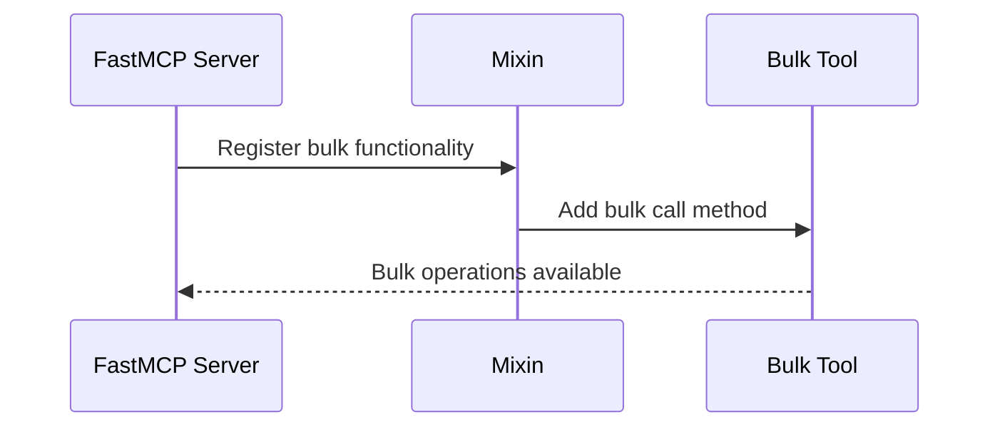

# Chapter 7: Mixin

In the previous chapter, we delved into the concept of [Prompt](06_prompt_.md), exploring how they act as conversational starters guiding interactions. Now, let's expand your FastMCP toolkit by understanding Mixins, a clever way to enhance the capabilities of your components without altering their core design.

## Motivation

Imagine you're baking a cake. You start with a basic vanilla cake recipe but want to add chocolate chips for extra flavor. Instead of redoing the entire recipe, you simply mix in the chocolate chips. Similarly, in FastMCP, Mixins allow you to add extra functionalities to components seamlessly.

### Central Use Case

Consider a scenario where you have a FastMCP server running a set of tools, but now you want to add a feature for those tools to handle bulk operations—executing multiple tasks in one go. Instead of re-engineering each tool, Mixins provide an elegant way to incorporate this functionality.

## Key Concepts

Let's break down the Mixins concept into a few friendly concepts:

### 1. Extend, Don't Modify

Mixins are like adding accessories to your outfit—you don't change your clothes; you enhance them for new occasions. They allow additional functionalities to be injected into existing components.

### 2. Flexible Enhancements

By using Mixins, you empower components with new abilities—like giving your vanilla cake upgrades without needing a whole new recipe.

### 3. Solver of Batch Problems

Specifically, in FastMCP, Mixins are often used for batch processing, allowing you to handle multiple tasks efficiently, much like a chef efficiently preparing all ingredients for a big meal.

## How to Use Mixins

Let's explore how Mixins can be used to solve our use case of adding bulk operations to tools. Here's a minimal and digestible guide:

### Step 1: Define a Mixin

First, create a Mixin to handle bulk tool calls. This is analogous to designing your chocolate chips to ensure they blend well into many types of cakes:

```python
from fastmcp.contrib.mcp_mixin.mcp_mixin import MCPMixin, mcp_tool

class BulkToolCaller(MCPMixin):
    @mcp_tool(name="call_tools_bulk")
    async def call_tools_bulk(self, tool_calls):
        # Logic for calling tools in bulk
        pass  # Skipping details for simplicity
```

**Explanation**: 
- `BulkToolCaller` class inherits `MCPMixin` to gain the ability to register new functionalities.
- The method `call_tools_bulk` is decorated with `@mcp_tool`, marking it for registration with a FastMCP server.

### Step 2: Use the Mixin in Your Server

Integrate the Mixin with a FastMCP server to enrich it with bulk processing capabilities:

```python
from fastmcp.server import FastMCP

server = FastMCP(name="MyServer")
bulk_caller = BulkToolCaller()

bulk_caller.register_tools(server)  # Register bulk functionality with server
```

**Explanation**:
- We instantiate `BulkToolCaller` and register its bulk tool functionalities with our server.
- This makes all decorated methods, like `call_tools_bulk`, available for use.

### Expected Outcome

With the setup complete, your server can now process multiple tool calls in a single request, making your operations efficient and streamlined.

## Internal Workings

Let's visualize how Mixins work behind the scenes, adding capabilities to existing components:



### Diving Deeper into the Code

Mixins work in the background to register and use new methods. Here's how the magic happens, using the file `mcp_mixin.py`:

```python
class MCPMixin:
    def register_tools(self, mcp_server):
        for method in dir(self):
            if callable(getattr(self, method)) and hasattr(getattr(self, method), "_mcp_tool_registration"):
                mcp_server.add_tool(fn=getattr(self, method))
```

**Explanation**:
- `MCPMixin` provides a framework to register tools.
- `register_tools` checks class methods marked with specific attributes, auto-registering them as tools.

## Conclusion

In this chapter, we've learned how Mixins in FastMCP elegantly extend component functionalities, enabling enhancements like bulk processing without altering existing systems. Look forward to the next chapter on [Resource](08_resource.md), where we'll explore how to manage and use various resources efficiently within the FastMCP framework. Keep learning and enjoy the journey!

---

Generated by [AI Codebase Knowledge Builder](https://github.com/The-Pocket/Tutorial-Codebase-Knowledge)