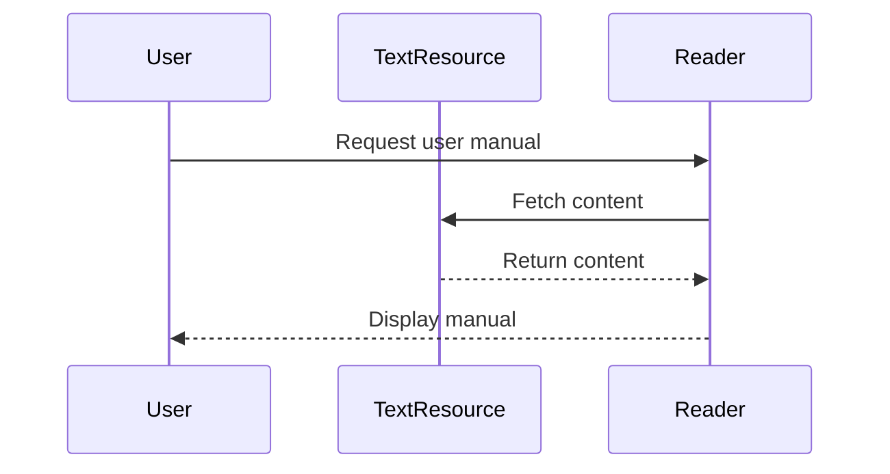

# Chapter 8: Resource

Welcome to Chapter 8! In the previous chapter, we discovered how [Mixins](07_mixin.md) give additional capabilities to your code components without modifying their core functionality. Now, we move on to explore "Resources" in FastMCP, which are crucial for accessing and managing various content forms within your project.

## Motivation

Imagine a library full of books, documents, and digital media. Each item within the library is a Resource, available for you whenever you need information or content. Similarly, a Resource in FastMCP acts as a repository of content, be it a simple text file, a complex dataset, or an API endpoint.

### Central Use Case

Consider you are building an online documentation system. You want users to read different documents and guides available on your server. Resources in FastMCP allow you to manage these documents systematically, enabling users to access information when needed.

## Key Concepts

To understand Resources better, let's break it down into simple concepts:

### 1. Different Forms

Resources can be static like a text file or dynamic like a document generated by a function. Think of them as either a paperback book that's always the same or an online article that updates with new content.

### 2. Resource Management

Managing resources in FastMCP is like arranging books on a library shelf. You keep everything organized so that readers (or your program) can quickly find and use the content they need.

### 3. Access and Retrieval

Accessing a Resource is like borrowing a book. You need a system to ensure that the right book (resource) is fetched efficiently and returned once read.

## How to Use a Resource

Let's create a simple text-based Resource to serve a user manual, guiding beginner users to interact with your system:

1. **Define a Text Resource**:

   ```python
   from fastmcp.resources.types import TextResource

   user_manual = TextResource(text="Welcome to the User Manual. Here's how to get started...")
   ```

   **Explanation**: 
   - We create a `TextResource` that holds a string, simulating a user manual. This stores the content you want to deliver to the readers.

2. **Accessing the Resource**:

   ```python
   async def access_manual():
       content = await user_manual.read()
       print(content)
   ```

   **Explanation**: 
   - The `read` method asynchronously retrieves the content stored in `user_manual`.
   - It then prints the content, enabling users to read the manual.

### Expected Output

When the `access_manual` function is called, the output will be:
```
Welcome to the User Manual. Here's how to get started...
```
This confirms the resource is successfully accessed and read.

## Internal Workings

To understand how Resources function within FastMCP, let's walk through the processing steps:

### Resource Interaction Sequence

Here's a simple sequence to show how a Resource is accessed:



### Code Behind the Magic

Let's take a glimpse at how Resources are managed under the hood using FastMCP's internal code:

- **Base Resource in `resource.py`**:

   ```python
   class Resource(BaseModel):
       uri: AnyUrl
       name: str | None
       description: str | None

       async def read(self) -> str:
           pass
   ```

   **Explanation**: 
   - The `Resource` class lays the groundwork with attributes like `uri`, `name`, and `description`.
   - The `read` method is defined as an abstract method to be implemented by different resource types like `TextResource`.

- **Text Resource in `types.py`**:

   ```python
   class TextResource(Resource):
       text: str

       async def read(self) -> str:
           return self.text
   ```

   **Explanation**:
   - `TextResource` extends `Resource`, adding a `text` attribute to store content.
   - The `read` method fetches this content, making it available when needed.

## Conclusion

In this chapter, we explored Resources in FastMCP, understanding their role as content holders within your setup. By utilizing Resources, you've learned how to manage and access various types of content efficiently. As you continue your journey, the next chapter on [Context](09_context.md) will guide you on keeping track of what's happening within your system, making the overall management more robust. Keep exploring and learning with FastMCP!

---

Generated by [AI Codebase Knowledge Builder](https://github.com/The-Pocket/Tutorial-Codebase-Knowledge)