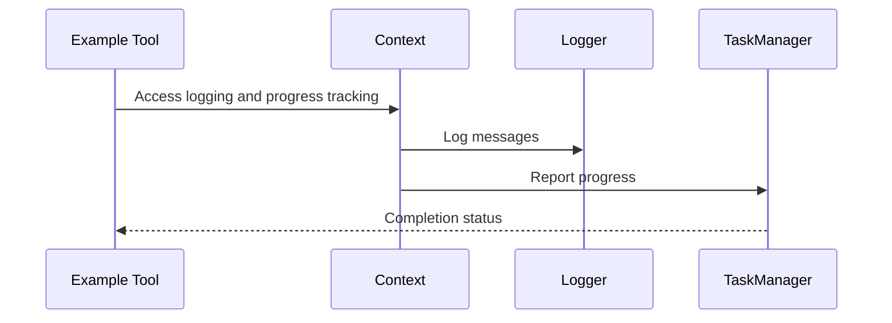

# Chapter 9: Context

Welcome back! In our last chapter, we learned about managing and accessing various [Resources](08_resource_.md) within FastMCP. Now, we turn our focus to understanding "Context" in FastMCP—a vital backstage environment that underpins your project's smooth execution.

## Motivation

Think of Context as the orchestra conductor in a grand performance, seamlessly coordinating every instrument to create beautiful music, all while the audience is unaware of the conductor's hard work. In FastMCP, Context is crucial for handling execution environments discreetly and efficiently.

### Central Use Case

Imagine setting up a data processing server that logs operations, tracks progress, and handles resource access behind the scenes. Using Context in FastMCP allows you to achieve this effortlessly, ensuring tasks execute smoothly without manual interventions.

## Key Concepts

To grasp the role of Context, let's break it down into beginner-friendly ideas:

### 1. Information Hub

Context is like a backstage control room. It quietly houses essential data and states needed during execution, ensuring everything goes without a hitch.

### 2. Logging System

Just as a conductor signals to each section of an orchestra, Context logs messages for critical actions—informing, warning, or debugging if needed.

### 3. Progress Tracker

Ever watched a progress bar on a loading screen? Context tracks the advancement of a task, showing management what's happening behind the scenes.

## How to Use Context

Let's see how Context helps you log and track a simple task within FastMCP. We'll create a tool that uses Context to manage its execution.

```python
from fastmcp.server import FastMCP
from fastmcp.server.context import Context

# Initialize the FastMCP server
server = FastMCP(name="MyServer")

@server.tool()
def example_tool(x: int, ctx: Context) -> str:
    ctx.info("Tool started")  # Log an info message
    ctx.report_progress(50, 100)  # Report progress
    ctx.info("Tool completed")  # Log completion message
    return f"Processed {x}"
```

**Explanation**:
- We initialize a FastMCP server named "MyServer".
- The `example_tool` function registers as a tool, using `Context` (annotated as `ctx`).
- Within the tool, we log messages and report task progress seamlessly.

### Expected Output

Running this tool will not visually display logs to users, but under the hood, it will log: "Tool started" and "Tool completed" while reporting its progress.

## Internal Workings

Let's look at how Context operates behind the curtain of FastMCP tool execution.

### Context Interaction Sequence

Here's a simple diagram showing how the Context coordinates during tool execution:



### Code Behind the Magic

The Context functionality in FastMCP is sophisticated yet simply organized within the `context.py` file:

#### Core Context Handling:

```python
class Context(BaseModel):
    # Initialize context with necessary parameters
    def __init__(self, request_context=None, fastmcp=None, **kwargs):
        super().__init__(**kwargs)
        self._request_context = request_context
        self._fastmcp = fastmcp

    async def report_progress(self, progress, total=None):
        # Implementation to send progress updates
        pass

    async def log(self, level, message, logger_name=None):
        # Implementation of logging functionality
        pass
```

**Explanation**:
- The `Context` class initializes optional elements required for logging and progress functions.
- Methods like `report_progress` and `log` handle progress tracking and logging.

## Conclusion

In Chapter 9, we've uncovered the crucial backstage role that Context plays in FastMCP, elegantly managing logging, progress, and access to resources unnoticed by end users. Equipped with this understanding, you're now ready to delve deeper into configurations with [Configuration and Settings](10_configuration_and_settings_.md), guiding your FastMCP projects easily and efficiently. Keep exploring, and enjoy your journey with FastMCP!

---

Generated by [AI Codebase Knowledge Builder](https://github.com/The-Pocket/Tutorial-Codebase-Knowledge)