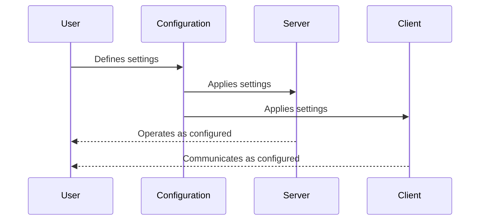

# Chapter 10: Configuration and Settings

In the previous chapter, we explored the essential role of [Context](09_context_.md) in FastMCP, offering a backstage environment for execution. Now, let's venture into "Configuration and Settings," the guiding blueprint for your FastMCP project, ensuring a smooth and efficient setup for both servers and clients.

## Motivation

Imagine you're assembling a brand-new car. The assembly instructions dictate how every part fits and functions to ensure optimal performance. Similarly, Configuration and Settings in FastMCP act as the instructions manual, defining how both your server and client should behave under various circumstances.

### Central Use Case

Consider you're setting up a FastMCP server and client for handling requests in a business application. You need to precisely define its behavior, such as logging levels or how to deal with duplicate tools, to ensure everything runs seamlessly. Configuration and settings enable you to tailor these behaviors effortlessly.

## Key Concepts

To give you a head start, let’s break down Configuration and Settings into understandable concepts:

### 1. Logging Levels

Think of logging levels as the volume of a radio. You can adjust logging from very detailed (DEBUG) to only critical issues (CRITICAL), helping you choose how much information you want to drown out or focus on.

### 2. Duplicate Handling Strategies

These are like referees in a game, showing how to handle duplicate players or actions, by either warning, replacing, ignoring, or calling an error.

### 3. Environment Behavior

Setting up environment variables is akin to pre-setting your thermostat preferences in a smart home so that your server and client adjust automatically to environmental changes.

## How to Use Configuration and Settings

Let's dive into what you need to configure on your FastMCP server and client to handle duplicates and log levels:

### Server Configuration

Define settings like logging level and duplicate tool behavior:

```python
from fastmcp.settings import ServerSettings

server_settings = ServerSettings(
    log_level="DEBUG", 
    on_duplicate_tools="warn"
)
```

**Explanation**:
- This snippet configures the FastMCP server to output detailed DEBUG logs, and it instructs the server to issue warnings when duplicate tools are encountered.

### Client Configuration

Similar to servers, set up client logging levels:

```python
from fastmcp.settings import ClientSettings

client_settings = ClientSettings(
    log_level="ERROR"
)
```

**Explanation**:
- Here, the client is configured to only log ERROR messages. This is like only raising flags when major issues occur.

### What Happens with These Settings?

With these configurations, your server and client tailor their operations to meet these pre-set conditions, enhancing efficiency and performance according to your defined "blueprints."

## Internal Workings

Let’s decode how FastMCP manages configurations using a simple sequence:

### Configuration Sequence



### Diving Deeper into Code

The setup work happens primarily in the settings files, like `settings.py`, which defines how configurations are structured:

#### Server and Client Settings

```python
# Simplified excerpt from settings.py
class ServerSettings(BaseSettings):
    log_level: LOG_LEVEL = "INFO"
    on_duplicate_tools: DuplicateBehavior = "warn"

class ClientSettings(BaseSettings):
    log_level: LOG_LEVEL = "INFO"
```

**Explanation**:
- Each setting class extends `BaseSettings`, providing a template for configuration, using default log levels and default behavior strategies.
- Settings are easily modifiable, allowing you to choose appropriate levels and strategies before application initiation.

## Conclusion

In this chapter, we've illuminated the role of Configuration and Settings, establishing them as the instructions for your FastMCP setup, ensuring your servers and clients behave precisely as needed. With these insights, you're now empowered to fine-tune your setups, streamlining management and facilitating effective operations. In the next chapter, we will tie everything together into actionable constructs, equipping you even further for adept FastMCP handling. Continue exploring in [Chapter 11: Putting It All Together](11_final_chapter.md)!

---

Generated by [AI Codebase Knowledge Builder](https://github.com/The-Pocket/Tutorial-Codebase-Knowledge)