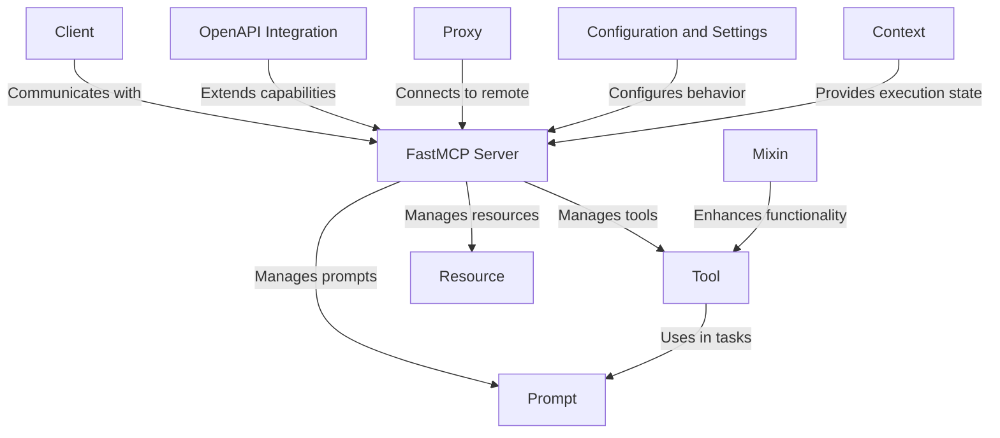

# Tutorial: fastmcp

**FastMCP** is a software framework designed to facilitate the integration
and management of various components such as **tools, resources, and prompts**
within a server environment. It acts as a central **hub**, enabling seamless
communication between clients and servers, **leveraging** protocols like OpenAPI
and offering flexible configuration settings for dynamic and complex workflows.

**Source Repository:** [https://github.com/jlowin/fastmcp](https://github.com/jlowin/fastmcp)

## Chapters

1. [FastMCP Server
](01_fastmcp_server_.md)
2. [Client
](02_client_.md)
3. [OpenAPI Integration
](03_openapi_integration_.md)
4. [Proxy
](04_proxy_.md)
5. [Tool
](05_tool_.md)
6. [Prompt
](06_prompt_.md)
7. [Mixin
](07_mixin_.md)
8. [Resource
](08_resource_.md)
9. [Context
](09_context_.md)
10. [Configuration and Settings
](10_configuration_and_settings_.md)

---

Generated by [AI Codebase Knowledge Builder](https://github.com/The-Pocket/Tutorial-Codebase-Knowledge)